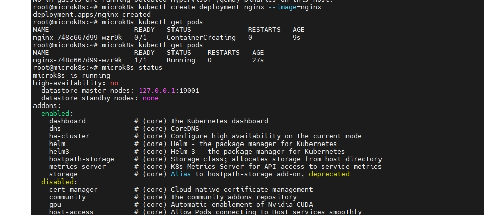
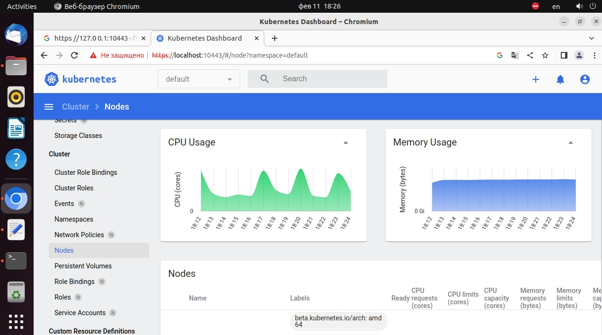
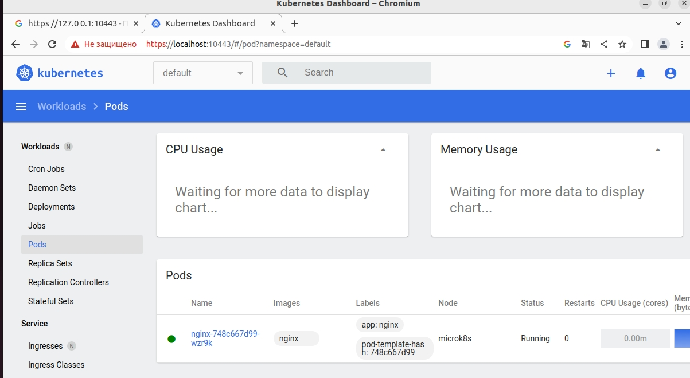

# Домашнее задание к занятию "Kubernetes. Причины появления. Команда kubectl" -dev-17_kuber-homeworks-1-yakovlev_vs
kuber-homeworks.1.1

### Цель задания

Для экспериментов и валидации ваших решений вам нужно подготовить тестовую среду для работы с Kubernetes. Оптимальное решение — развернуть на рабочей машине или на отдельной виртуальной машине MicroK8S.

------

### Чеклист готовности к домашнему заданию

1. Личный компьютер с ОС Linux или MacOS 

или

2. ВМ c ОС Linux в облаке либо ВМ на локальной машине для установки MicroK8S  

------

### Инструкция к заданию

1. Установка MicroK8S:
    - sudo apt update
    - sudo apt install snapd
    - sudo snap install microk8s --classic
    - добавить локального пользователя в группу `sudo usermod -a -G microk8s $USER`
    - изменить права на папку с конфигурацией `sudo chown -f -R $USER ~/.kube`

2. Полезные команды:
    - проверить статус `microk8s status --wait-ready`
    - подключиться к microK8s и получить информацию можно через команду `microk8s command`, например, `microk8s kubectl get nodes`
    - включить addon можно через команду `microk8s enable` 
    - список addon'ов `microk8s status`
    - вывод конфигурации `microk8s config`
    - проброс порта для подключения локально `microk8s kubectl port-forward -n kube-system service/kubernetes-dashboard 10443:443`

3. Настройка внешнего подключения:
    - Отредактировать файл /var/snap/microk8s/current/certs/csr.conf.template
    ```shell
    # [ alt_names ]
    # Add
    # IP.4 = 123.45.67.89
    ```
    - Обновить сертификаты `sudo microk8s refresh-certs --cert front-proxy-client.crt`

4. Установка kubectl:
    - curl -LO https://storage.googleapis.com/kubernetes-release/release/`curl -s https://storage.googleapis.com/kubernetes-release/release/stable.txt`/bin/linux/amd64/kubectl
    - chmod +x ./kubectl
    - sudo mv ./kubectl /usr/local/bin/kubectl 
    - настройка автодополнения в текущую сессию `bash source <(kubectl completion bash)`
    - добавление автодополнения в командную оболочку bash `echo "source <(kubectl completion bash)" >> ~/.bashrc`

------

### Инструменты/ дополнительные материалы, которые пригодятся для выполнения задания

1. [Инструкция](https://microk8s.io/docs/getting-started) по установке MicroK8S
2. [Инструкция](https://kubernetes.io/ru/docs/reference/kubectl/cheatsheet/#bash) по установке автодополнения **kubectl**
3. [Шпаргалка](https://kubernetes.io/ru/docs/reference/kubectl/cheatsheet/) по **kubectl**

------

### Задание 1. Установка MicroK8S

1. Установить MicroK8S на локальную машину или на удаленную виртуальную машину
2. Установить dashboard
3. Сгенерировать сертификат для подключения к внешнему ip-адресу

#### Решение

- 1
```bash
root@microk8s:~# microk8s status
microk8s is running
high-availability: no
  datastore master nodes: 127.0.0.1:19001
  datastore standby nodes: none
addons:
  enabled:
    dashboard            # (core) The Kubernetes dashboard
    dns                  # (core) CoreDNS
    ha-cluster           # (core) Configure high availability on the current node
    helm                 # (core) Helm - the package manager for Kubernetes
    helm3                # (core) Helm 3 - the package manager for Kubernetes
    hostpath-storage     # (core) Storage class; allocates storage from host directory
    metrics-server       # (core) K8s Metrics Server for API access to service metrics
    storage              # (core) Alias to hostpath-storage add-on, deprecated
  disabled:
    cert-manager         # (core) Cloud native certificate management
    community            # (core) The community addons repository
    gpu                  # (core) Automatic enablement of Nvidia CUDA
    host-access          # (core) Allow Pods connecting to Host services smoothly
    ingress              # (core) Ingress controller for external access
    kube-ovn             # (core) An advanced network fabric for Kubernetes
    mayastor             # (core) OpenEBS MayaStor
    metallb              # (core) Loadbalancer for your Kubernetes cluster
    minio                # (core) MinIO object storage
    observability        # (core) A lightweight observability stack for logs, traces and metrics
    prometheus           # (core) Prometheus operator for monitoring and logging
    rbac                 # (core) Role-Based Access Control for authorisation
    registry             # (core) Private image registry exposed on localhost:32000 
```

- 2

```bash
root@microk8s:~# microk8s enable dashboard
Infer repository core for addon dashboard
Enabling Kubernetes Dashboard
Infer repository core for addon metrics-server
Enabling Metrics-Server
serviceaccount/metrics-server created
clusterrole.rbac.authorization.k8s.io/system:aggregated-metrics-reader created
clusterrole.rbac.authorization.k8s.io/system:metrics-server created
rolebinding.rbac.authorization.k8s.io/metrics-server-auth-reader created
clusterrolebinding.rbac.authorization.k8s.io/metrics-server:system:auth-delegator created
clusterrolebinding.rbac.authorization.k8s.io/system:metrics-server created
service/metrics-server created
deployment.apps/metrics-server created
apiservice.apiregistration.k8s.io/v1beta1.metrics.k8s.io created
clusterrolebinding.rbac.authorization.k8s.io/microk8s-admin created
Metrics-Server is enabled
Applying manifest
serviceaccount/kubernetes-dashboard created
service/kubernetes-dashboard created
secret/kubernetes-dashboard-certs created
secret/kubernetes-dashboard-csrf created
secret/kubernetes-dashboard-key-holder created
configmap/kubernetes-dashboard-settings created
role.rbac.authorization.k8s.io/kubernetes-dashboard created
clusterrole.rbac.authorization.k8s.io/kubernetes-dashboard created
rolebinding.rbac.authorization.k8s.io/kubernetes-dashboard created
clusterrolebinding.rbac.authorization.k8s.io/kubernetes-dashboard created
deployment.apps/kubernetes-dashboard created
service/dashboard-metrics-scraper created
deployment.apps/dashboard-metrics-scraper created
secret/microk8s-dashboard-token created

If RBAC is not enabled access the dashboard using the token retrieved with:

microk8s kubectl describe secret -n kube-system microk8s-dashboard-token

Use this token in the https login UI of the kubernetes-dashboard service.

In an RBAC enabled setup (microk8s enable RBAC) you need to create a user with restricted
permissions as shown in:
https://github.com/kubernetes/dashboard/blob/master/docs/user/access-control/creating-sample-user.md

```
- 3
Был сгенерирован. Добавил на машину с microk8s.
```bash
root@ansibleserv:~# ssh-copy-id root@192.168.1.88
/usr/bin/ssh-copy-id: INFO: Source of key(s) to be installed: "/root/.ssh/id_rsa.pub"
The authenticity of host '192.168.1.88 (192.168.1.88)' can't be established.
ECDSA key fingerprint is SHA256:kGI/tErOOaOTDAQASnuMHQ3EUJSxoxQ8AqqIcst+4z0.
Are you sure you want to continue connecting (yes/no/[fingerprint])? yes
/usr/bin/ssh-copy-id: INFO: attempting to log in with the new key(s), to filter out any that are already installed
/usr/bin/ssh-copy-id: INFO: 1 key(s) remain to be installed -- if you are prompted now it is to install the new keys
root@192.168.1.88's password:

Number of key(s) added: 1

Now try logging into the machine, with:   "ssh 'root@192.168.1.88'"
and check to make sure that only the key(s) you wanted were added.
```


------

### Задание 2. Установка и настройка локального kubectl
1. Установить на локальную машину kubectl
2. Настроить локально подключение к кластеру
3. Подключиться к дашборду с помощью port-forward

- 1 

```bash
root@ansibleserv:~# curl -LO https://storage.googleapis.com/kubernetes-release/release/`curl -s https://storage.googleapis.com/kubernetes-release/release/stable.txt`/bin/linux/amd64/kubectl
  % Total    % Received % Xferd  Average Speed   Time    Time     Time  Current
                                 Dload  Upload   Total   Spent    Left  Speed
100 45.7M  100 45.7M    0     0  9709k      0  0:00:04  0:00:04 --:--:-- 10.9M
root@ansibleserv:~# chmod +x ./kubectl
root@ansibleserv:~# sudo mv ./kubectl /usr/local/bin/kubectl
root@ansibleserv:~# bash source <(kubectl completion bash)
bash: source: No such file or directory
root@ansibleserv:~# echo "source <(kubectl completion bash)" >> ~/.bashrc
root@ansibleserv:~# source <(kubectl completion bash)
root@ansibleserv:~# echo "source <(kubectl completion bash)" >> ~/.bashrc
root@ansibleserv:~# alias k=kubectl
root@ansibleserv:~# complete -F __start_kubectl k
```

- 2
```bash
root@microk8s:~# microk8s config > ~/.kube/config
```
```bash
root@microk8s:~# kubectl get nodes
NAME       STATUS   ROLES    AGE    VERSION
microk8s   Ready    <none>   111m   v1.26.1
root@microk8s:~#

```

```bash
root@ansibleserv:~# ls -l /root/.kube/
total 8
drwxr-x--- 4 root root 4096 Feb 11 16:07 cache
-rw-r--r-- 1 root root 1874 Feb 11 16:07 config
root@ansibleserv:/usr/local/bin# kubectl get pod
NAME                     READY   STATUS    RESTARTS   AGE
nginx-748c667d99-pc49v   1/1     Running   0          47m
root@ansibleserv:/usr/local/bin# kubectl get nodes
NAME       STATUS   ROLES    AGE   VERSION
microk8s   Ready    <none>   83m   v1.26.1
```

- 3







------

### Правила приема работы

1. Домашняя работа оформляется в своем Git репозитории в файле README.md. Выполненное домашнее задание пришлите ссылкой на .md-файл в вашем репозитории.
2. Файл README.md должен содержать скриншоты вывода команд `kubectl get nodes`, а также скриншот дашборда

------

### Критерии оценки
Зачет - выполнены все задания, ответы даны в развернутой форме, приложены соответствующие скриншоты и файлы проекта, в выполненных заданиях нет противоречий и нарушения логики.

На доработку - задание выполнено частично или не выполнено, в логике выполнения заданий есть противоречия, существенные недостатки.
